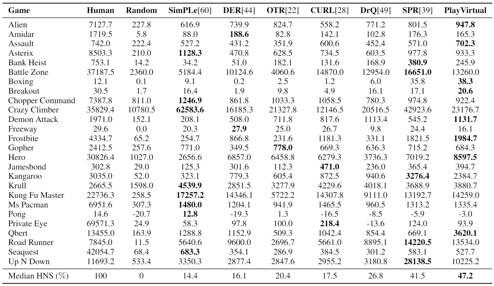

# PlayVirtual for Atari
## Installation
Install the requirements:
~~~
pip install -r requirements.txt
~~~

## Usage
Train PlayVirtual:
~~~
python -m scripts.run --public --jumps 9 --fp --fp-weight 1 --cycle-step 9 --virtual-cycle --vc-weight 1 --game pong --seed 1
~~~
Some important options:
* `--jumps`: forward prediction steps
* `--fp`: to enable "fp" for forward prediction
* `--fp-weight`: forward prediction loss weight
* `--cycle-step`: prediction steps in trajectory cycle (i.e., horizon length)
* `--virtual-cycle`: to enble "virtual-cycle" for cycle consistency learning
* `--vc-weight`: cycle loss weight
* `--game`: to specify the game
* `--seed`: to specify the seed

## Result
We achieve the best result (47.2% median HNS) on the Atari-100k benchmark. Our result is averaged over 15 random seeds.

## Acknowledgement
Our implementation on Atari is based on [SPR](https://github.com/mila-iqia/spr) by Max Schwarzer & Ankesh Anand. We sincerely thank the authors.
