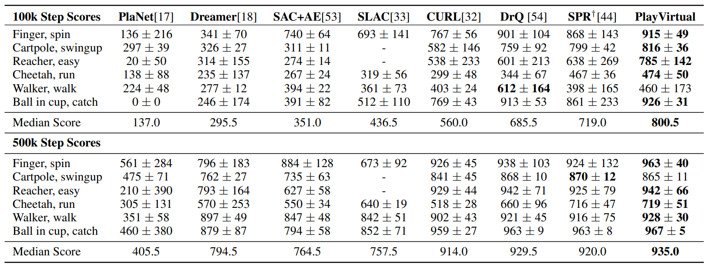

## Installation
First, you should install [Mujoco](https://mujoco.org/download). For example, you can install Mujoco as follows if your system is Linux:
~~~
wget https://mujoco.org/download/mujoco210-linux-x86_64.tar.gz
tar -zxvf mujoco210-linux-x86_64.tar.gz
mkdir ~/.mujoco
mv mujoco210 ~/.mujoco/
echo 'export LD_LIBRARY_PATH="$HOME/.mujoco/mujoco210/bin:$LD_LIBRARY_PATH"' >> ~/.bashrc
echo 'export LD_LIBRARY_PATH="/usr/local/nvidia/lib64:$LD_LIBRARY_PATH"' >> ~/.bashrc
echo 'export MUJOCO_KEY_PATH="$HOME/.mujoco$MUJOCO_KEY_PATH"' >> ~/.bashrc
source ~/.bashrc
export LD_LIBRARY_PATH="$HOME/.mujoco/mujoco210/bin:$LD_LIBRARY_PATH"
export LD_LIBRARY_PATH="/usr/local/nvidia/lib64:$LD_LIBRARY_PATH"
export MUJOCO_KEY_PATH="$HOME/.mujoco$MUJOCO_KEY_PATH"
~~~

Then install the requirements:
~~~
pip install -r requirements.txt
~~~

Uninstall glfw to avoid core dumped:
~~~
pip uninstall glfw -y
~~~

## Usage
Here we give the configuration files in the `./src/configs` folder for the six environments mentioned in the paper. 

```
cd ./src
python train.py --config-path ./configs --config-name cartpole_swingup \
    seed=1 agent=cycdm_sac num_env_steps=500000 work_dir=./cycdm_outputs/
```

Some important options in configuration files:
* `cycle_mode`: "fp+cycle" indicating PlayVirtual agent
* `jumps`: forward prediction steps
* `fp_loss_weight`: forward prediction loss weight
* `cycle-step`: prediction steps in trajectory cycle (i.e., horizon length)
* `vc_loss_weight`: cycle loss weight

<!-- This repository supports 3 agents so far:
1. `cycdm_sac`: our algorithm (i.e., PlayVirtual)
2. `curl_sac`: algorithm proposed in CURL
3. `spr_sac`: algorithm proposed in SPR -->

Local results are stored in subfold `cycdm_outputs`. Note that we use Weights & Bias as the default visualization platform and Hydra as the config parser to launch the experiment. To use Weights & Bias, please register and login to the platform first. More instructions for using Hydra to overwrite hyperparameters can be found in [hydra intro doc](https://hydra.cc/docs/intro). More instructions for using Weights & Bias as online tracker can be found in the official [wandb documentation](https://docs.wandb.ai/). Adding the `wandb=true` in command line will sync the results in Weights & Biases. 

Please overwrite `agent`, `seed` and `work_dir` in the command line or modify the `config.yaml` and train agent by running `python train.py` without adding modified hyperparameters in the command line. 
We also give running options of ablations (e.g. the mode of PlayVirtual) in this file.

In your console, you can see printouts that look like:

```
| eval | S: 0 | ER: 16.4555
| train | E: 1 | S: 4000 | D: 0.4 s | R: 0.0000 | BR: 0.0000 | A_LOSS: 0.0000 | C_LOSS: 0.0000 | CURL_LOSS: 0.0000 | SPR_LOSS: 0.0000 | CYCDM_LOSS: 0.0000
| train | E: 5 | S: 5000 | D: 0.0 s | R: 42.8906 | BR: 0.0000 | A_LOSS: 0.0000 | C_LOSS: 0.0000 | CURL_LOSS: 0.0000 | SPR_LOSS: 0.0000 | CYCDM_LOSS: 0.0000
| eval | S: 5000 | ER: 15.8908
| train | E: 0 | S: 8000 | D: 0.4 s | R: 0.0000 | BR: 0.0000 | A_LOSS: 0.0000 | C_LOSS: 0.0000 | CURL_LOSS: 0.0000 | SPR_LOSS: 0.0000 | CYCDM_LOSS: 0.0000
| train | E: 9 | S: 10000 | D: 0.0 s | R: 186.1106 | BR: 1.1104 | A_LOSS: -1.7395 | C_LOSS: 3.7469 | CURL_LOSS: 0.0000 | SPR_LOSS: 0.0000 | CYCDM_LOSS: 4.2253
| eval | S: 10000 | ER: 14.7401
```

Log abbreviation mapping:

```
train - training episode
E - total number of episodes 
S - total number of environment steps
D - duration in seconds to train 1 episode
R - mean episode reward
BR - average reward of sampled batch
A_LOSS - average loss of actor
C_LOSS - average loss of critic
CYCDM_LOSS - average loss of the CYCDM(PlayVirtual) auxiliary task
```

## Result
We achieve the best result on both DMControl-100k and DMControl-500k benchmarks. Our result is averaged over 10 random seeds.



## Acknowledgement
Our implementation on DMControl is based on [CURL](https://github.com/MishaLaskin/curl) by Michael Laskin & Aravind Srinivas. We sincerely thank the authors.