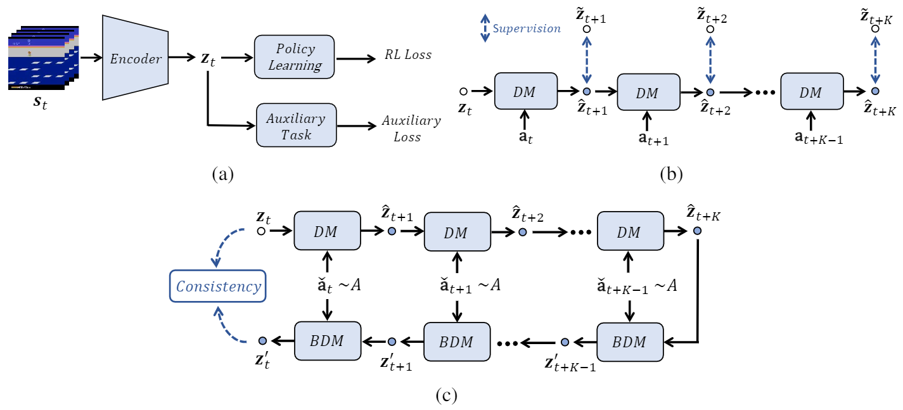

# PlayVirtual: Augmenting Cycle-Consistent Virtual Trajectories for Reinforcement Learning

This is the official implementation of *PlayVirtual* (accepted to NeurIPS 2021), which augments cycle-consistent virtual trajectories to enhance the data efficiency for RL feature representation learning.

## Abstract
Learning good feature representations is important for deep reinforcement learning (RL). However, with limited experience, RL often suffers from data inefficiency for training. For un-experienced or less-experienced trajectories (i.e., state-action sequences), the lack of data limits the use of them for better feature learning. In this work, we propose a novel method, dubbed PlayVirtual, which augments cycle-consistent virtual trajectories to enhance the data efficiency for RL feature representation learning. Specifically, PlayVirtual predicts future states in a latent space based on the current state and action by a dynamics model and then predicts the previous states by a backward dynamics model, which forms a trajectory cycle. Based on this, we augment the actions to generate a large amount of virtual state-action trajectories. Being free of groudtruth state supervision, we enforce a trajectory to meet the cycle consistency constraint, which can significantly enhance the data efficiency. We validate the effectiveness of our designs on the Atari and DeepMind Control Suite benchmarks. Our method achieves the state-of-the-art performance on both benchmarks.

## Framework



Figure 1. (a) A glance at the overall framework which consists of an encoder for learning the latent state representation $\mathbf{z}_t$, a policy learning head, and our auxiliary task module. The auxiliary task module consumes a real trajectory as shown in (b) and an augmented virtual trajectory as shown in (c), respectively. In (b), we train the dynamics model (DM) to be predictive of the future state based on the input state and action, with the supervision from the future state. To enhance data efficiency, as shown in (c), we augment the actions to generate a virtual trajectory formed by a forward and a backward trajectory. Particularly, the forward state-action trajectory is obtained based on the current state $\mathbf{z}_t$, the DM and a sequence of augmented/generated actions (i.e., for $K$ steps). Similarly, based on the predicted future state $\hat{\mathbf{z}}_{t+K}$, a backward dynamics model (BDM), and that sequence of augmented actions, we obtain the backward state-action trajectory. *For the virtual trajectory, we add the consistency constraint on the current state $\mathbf{z}_t$ and the predicted current state $\mathbf{z}'$ for optimizing the feature representations.*


- [Paper](https://openreview.net/forum?id=GSHFVNejxs7&referrer=%5BAuthor%20Console%5D(%2Fgroup%3Fid%3DNeurIPS.cc%2F2021%2FConference%2FAuthors%23your-submissions))
- [Talk](https://recorder-v3.slideslive.com/#/share?share=49190&s=d537bfb4-ae97-42b4-b4d3-c50f1f607df8)

  
## Run PlayVirtual
We provide codes for two benchmarks: Atari and DMControl.
~~~
.
├── Atari
|   ├── README.md
|   └── ...
|── DMControl
|   ├── README.md
|   └── ...
├── CODE_OF_CONDUCT.md
├── LICENSE
├── README.md
├── SUPPORT.md
└── SECURITY.md
~~~

Run Atari code: enter ./Atari for more information.
~~~
cd ./Atari
~~~
Run DMControl code: enter ./DMControl for more information.
~~~
cd ./DMControl
~~~

## Citation
  ```
  @article{yu2021playvirtual,
    title={Playvirtual: Augmenting cycle-consistent virtual trajectories for reinforcement learning},
    author={Yu, Tao and Lan, Cuiling and Zeng, Wenjun and Feng, Mingxiao and Zhang, Zhizheng and Chen, Zhibo},
    journal={Advances in Neural Information Processing Systems},
    volume={34},
    year={2021}
  }
  ```
  
## Acknowledgement

Some implementation is based on [SPR](https://github.com/mila-iqia/spr) and [CURL](https://github.com/MishaLaskin/curl). Many thanks for their wonderful works.
